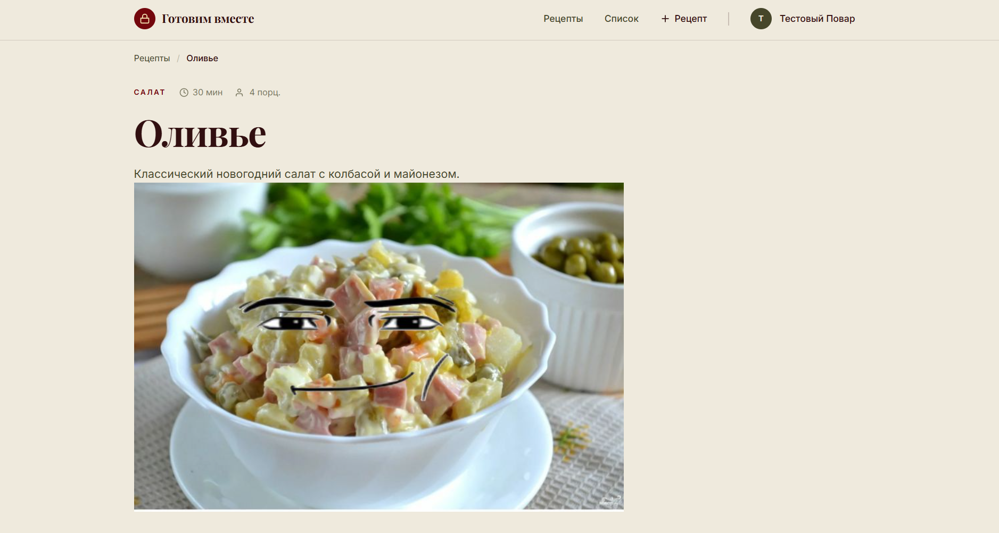
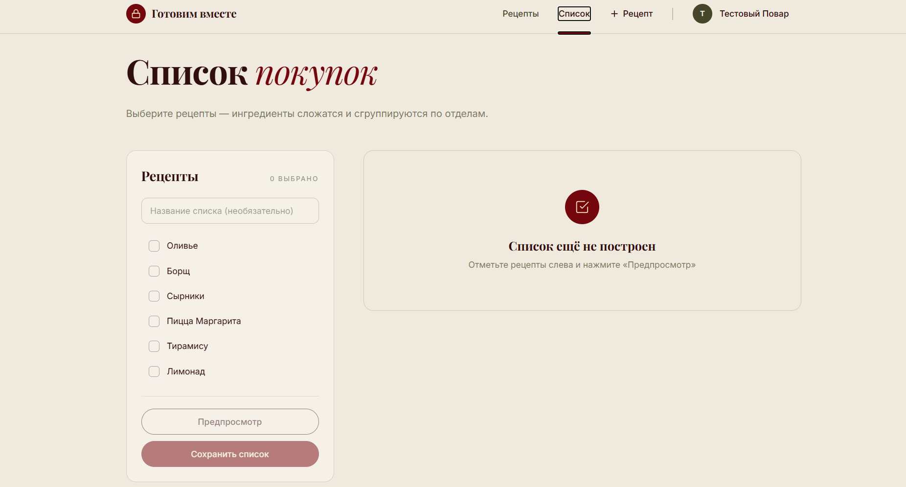
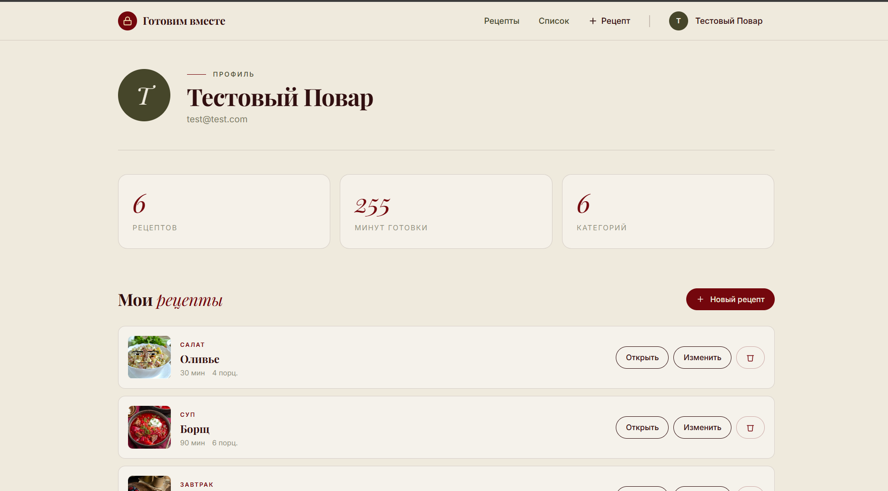

# Готовим вместе

Интерактивная кулинарная платформа с пошаговыми рецептами, видеоуроками и умным списком покупок.
<p align="center">
  
  
  
  
  
  
  <a href="https://github.com/ns8091991-sys/cooking-blog/actions/workflows/tests.yml">
    
  </a>
</p>

---

## Живой проект

| | Ссылка |
|---|---|
| **Сайт** | https://cooking-blog-azure-pi.vercel.app |
| **API** | https://cooking-blog-backend.onrender.com |
| **Swagger** | https://cooking-blog-backend.onrender.com/docs |

### Тестовый аккаунт
Email: test@test.com
Пароль: secret123


> Backend на бесплатном тарифе Render «засыпает» после 15 минут простоя. Первый запрос может занять **до 60 секунд** — подождите и обновите страницу.

---

##  Что это

**«Готовим вместе»** — веб-приложение, в котором каждый рецепт превращается в интерактивный гид, а система сама собирает список покупок из выбранных блюд.

### Проблемы, которые решает

-  Обычные рецепты — это «стена текста», в которой легко потеряться
-  Видео на YouTube — нужный момент не найдёшь
-  Список покупок приходится составлять вручную

### Решение

-  **Пошаговые видеоуроки** — рецепт разбит на короткие шаги с видео и таймерами
-  **Умный список покупок** — выбираете несколько рецептов, ингредиенты **автоматически складываются** и группируются по отделам магазина
-  **Личный кабинет** — профиль, «Мои рецепты», статистика

---

## Возможности

### Рецепты
- Создание, редактирование, удаление (только автор)
- Категории (завтрак, суп, салат, десерт и др.)
- Время готовки, количество порций, фото блюда
- Пошаговое приготовление с нумерацией и таймерами
- Список ингредиентов с количеством и единицами

### Умный список покупок
- Выбор нескольких рецептов
- **Автоматическое объединение** одинаковых ингредиентов (200 г + 300 г = 500 г)
- **Группировка по категориям** — овощи, мясо, бакалея, молочное…
- Сохранение списков
- Отметки «куплено» — прямо в магазине

### Авторизация
- Регистрация и вход (JWT)
- Защищённые эндпоинты
- Только автор может редактировать/удалять рецепт

### Интерфейс
-  Редакционный дизайн (кремовый + бордо)
-  Адаптивная вёрстка (мобильные, планшеты, десктоп)
-  Бургер-меню на телефоне
-  Красивые карточки с фото
-  Поиск и фильтры по категориям
-  404-страница

---

## Стек

### Backend
| Технология | Назначение |
|---|---|
| **Python 3.11** | Основной язык |
| **FastAPI** | REST API + Swagger |
| **Uvicorn** | ASGI-сервер |
| **SQLAlchemy 2.0** | ORM |
| **Alembic** | Миграции БД |
| **SQLite** | База данных (легко переключить на PostgreSQL) |
| **Pydantic v2** | Валидация данных |
| **python-jose + bcrypt** | JWT + хеширование паролей |

### Frontend
| Технология | Назначение |
|---|---|
| **React 18** | UI |
| **Vite** | Сборщик |
| **React Router v6** | Навигация |
| **Axios** | HTTP-запросы |
| **Чистый CSS** | Стили (без фреймворков) |

### DevOps
- **GitHub** — репозиторий
- **Render** — хостинг backend
- **Vercel** — хостинг frontend

---

## Быстрый старт (локально)

### Требования
- **Python 3.11+**
- **Node.js 20+**
- **Git**

### 1. Клонировать проект

```bash
git clone https://github.com/ns8091991-sys/cooking-blog.git
cd cooking-blog

## Скриншоты

### Главная страница


### Каталог рецептов



### Детальная страница рецепта

.png)

### Умный список покупок



### Профиль


